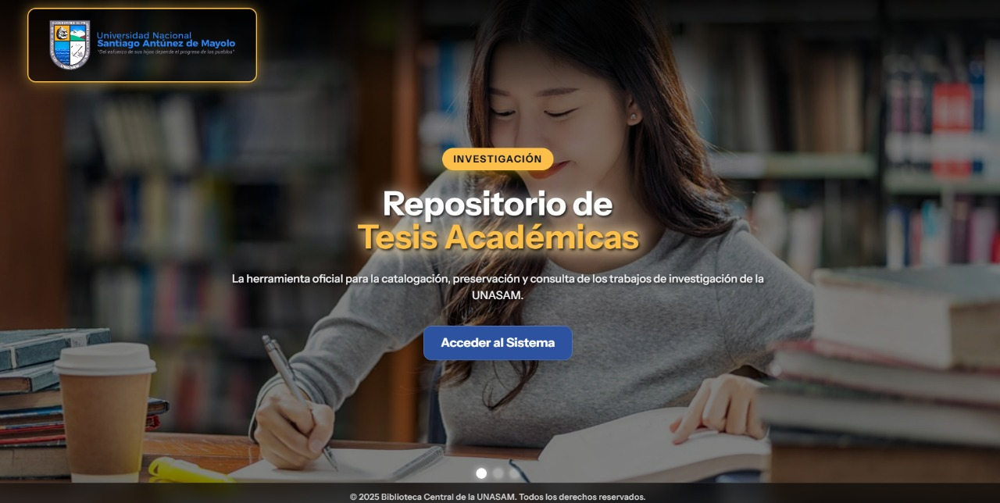
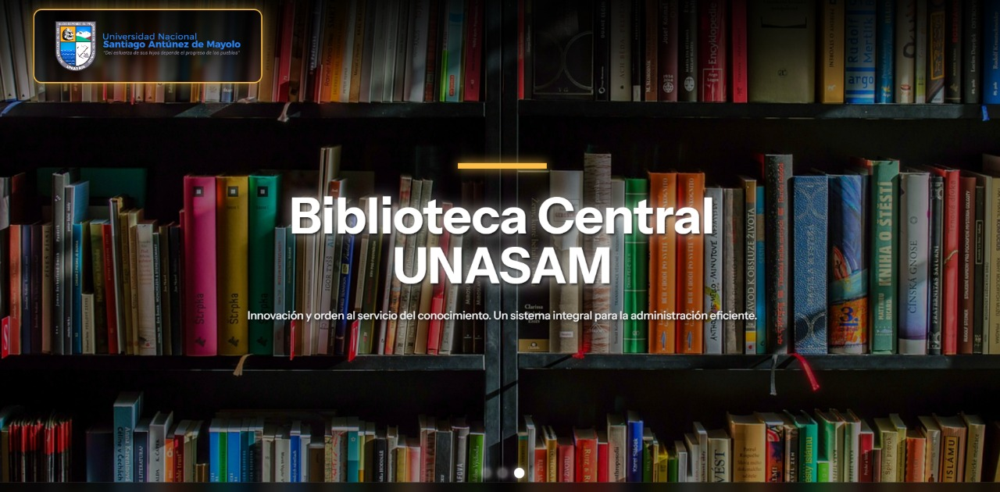
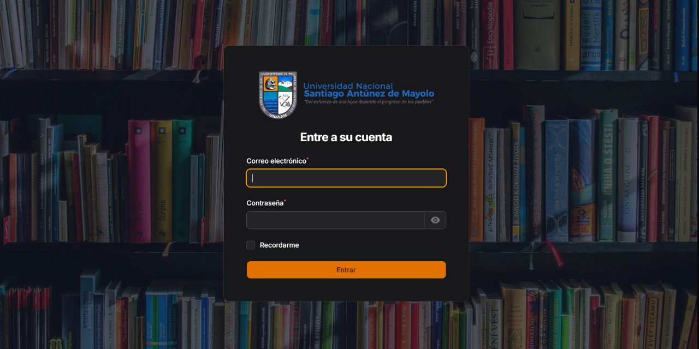
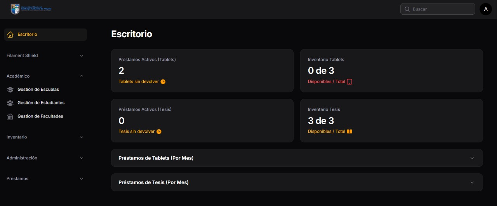
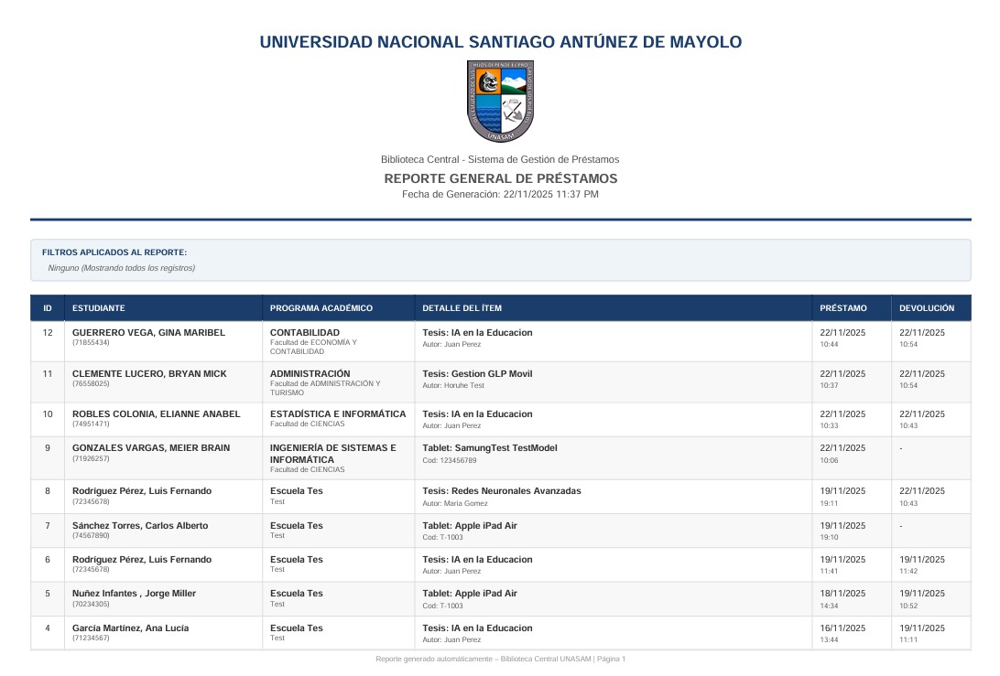

# Sistema de Gestión de Préstamos - Biblioteca Central UNASAM


Este sistema es una plataforma integral desarrollada para la **Biblioteca Central de la Universidad Nacional Santiago Antúnez de Mayolo (UNASAM)**. Su objetivo principal es digitalizar y controlar el flujo de préstamos de material bibliográfico (Tesis) y tecnológico (Tablets) a la comunidad universitaria.

## Características Principales

### Seguridad y Roles (RBAC)
El sistema implementa una gestión de permisos granular utilizando **Filament Shield**:
* **Administrador:** Acceso total al sistema, gestión de usuarios y configuraciones.
* **Encargado de Tablet:** Acceso exclusivo al inventario y préstamos de equipos tecnológicos.
* **Encargado de Tesis:** Acceso exclusivo al repositorio bibliográfico.

### Gestión de Inventario
* Registro detallado de **Tablets** (Marca, Modelo, Código, Estado Físico).
* Catalogación de **Tesis** (Título, Autor).
* Control de stock en tiempo real y estados de disponibilidad.

### Flujo de Préstamos Inteligente
* **Validación de Negocio:** Impide préstamos duplicados (un estudiante no puede tener dos tablets al mismo tiempo).
* **Formulario Dinámico:** Interfaz reactiva que adapta los campos según el tipo de ítem seleccionado.
* **Cálculo Automático:** Gestión de fechas de entrega y cambios de estado automáticos.

### Reportes y Documentación
* **Boletas de Préstamo:** Generación de comprobantes en PDF individuales con diseño institucional.
* **Reportes Generales:** Exportación de listados filtrados (por fecha, estudiante, tipo) usando **DOMPDF**.
* **Dashboard Analítico:** Gráficos interactivos y estadísticas en tiempo real sobre el uso de los recursos.

## Tecnologías Utilizadas

* **Backend Framework:** Laravel 12
* **Admin Panel:** Filament PHP
* **Base de Datos:** MySQL
* **PDF Generation:** Barryvdh DomPDF
* **Frontend:** Blade & TailwindCSS
* **Autenticación:** Filament Auth

## Instalación y Configuración

Sigue estos pasos para levantar el proyecto en tu entorno local:

1.  **Clonar el repositorio**
    ```bash
    git clone [https://github.com/tu-usuario/nombre-repo.git](https://github.com/tu-usuario/nombre-repo.git)
    cd nombre-repo
    ```

2.  **Instalar dependencias**
    ```bash
    composer install
    npm install && npm run build
    ```

3.  **Configurar entorno**
    ```bash
    cp .env.example .env
    php artisan key:generate
    ```
    *Configura tus credenciales de base de datos en el archivo `.env`.*

4.  **Base de Datos y Migraciones**
    ```bash
    php artisan migrate
    ```

5.  **Crear un Super Administrador**
    ```bash
    php artisan shield:super-admin
    ```

6.  **Symlink para imágenes** (Necesario para el logo)
    ```bash
    php artisan storage:link
    ```

## Capturas de Pantalla

### Welcome Personalizado
||||

### Login Personalizado


### Dashboard con Gráficos
(screenshots/graf_tab.jpg)(screenshots/graf_tes.jpg)

### Reporte PDF Generado


## Nota sobre la API de Estudiantes

Este proyecto incluye una integración con la API de la UNASAM para la obtención de datos de estudiantes. Por motivos de seguridad, las credenciales de acceso y endpoints no se incluyen en el repositorio público. El sistema está configurado para funcionar en modo "Demo" si no se detectan dichas credenciales en el archivo `.env`.

---
Desarrollado por **Nuñez Infantes Jorge** - Ingeniero de Sistemas
